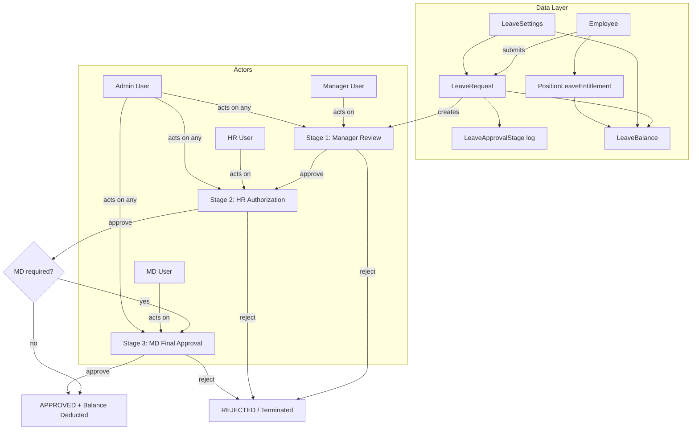
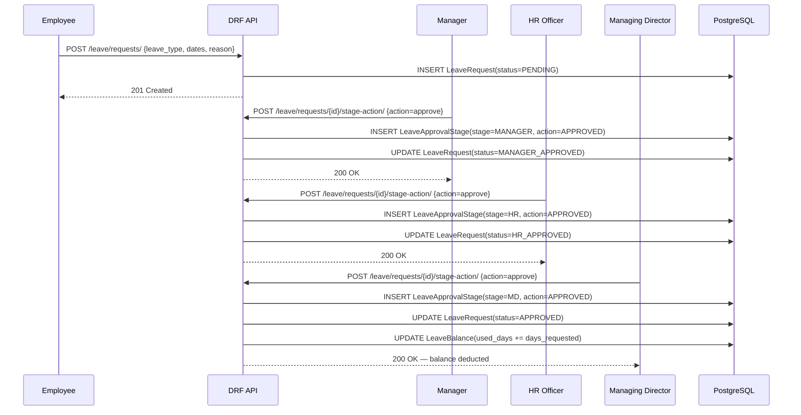
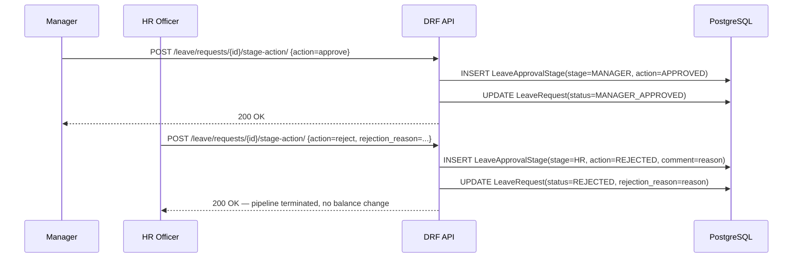

# Design Document: Leave Approval Workflow

## Overview

This feature replaces the current single-step leave approval on `LeaveRequest` with a configurable
multi-stage approval pipeline consisting of: Manager review (mandatory) → HR authorization (mandatory)
→ MD final approval (optional, per `LeaveType` policy). Each stage is recorded as an immutable log
entry in a new `LeaveApprovalStage` model, giving full audit history. Leave balance is only deducted
once every required stage has passed.

The design also enforces **outstanding-balance-based leave requests**: an employee may only request
leave days up to their current outstanding (remaining) balance. A new `LeaveSettings` model provides
organisation-wide configuration including whether unused leave days are **carried forward** into the
next financial year. Carry-forward is processed at year rollover and adds to the new year's
`LeaveBalance.carried_over` field.

Leave days are **accrued progressively** based on the employee's `date_joined`, the current date,
and the annual entitlement defined per position via a new `PositionLeaveEntitlement` model. Each
month of service accrues a proportional share of the annual allowance. The accrued total — not the
full annual entitlement — caps how many days the employee may request at any given time. A scheduled
management command (`accrue_leave`) runs monthly to post accrual entries, and `LeaveBalance.accrued_days`
tracks the running total for the current year.

The design introduces two new User roles (`MANAGER`, `MD`) and a manager-relationship field on
`Employee`, while keeping backward compatibility with the existing `ADMIN`, `HR`, `FINANCE`, and
`EMPLOYEE` roles. The `LeaveRequest.status` field is preserved and extended with new intermediate
values (`MANAGER_APPROVED`, `HR_APPROVED`) to let the existing list/filter APIs continue working
without breaking changes.

Existing records with `status=APPROVED` or `status=REJECTED` are treated as already-completed
single-stage approvals and are not re-routed through the new pipeline.

---

## Architecture




## Sequence Diagrams

### Happy Path — MD Required



### Rejection at HR Stage




## Components and Interfaces

### Component 1: `LeaveApprovalStage` model (new)

**Purpose**: Immutable audit log — one row per stage action taken on a `LeaveRequest`.

**Interface**:
```python
class LeaveApprovalStage(models.Model):
    class Stage(models.TextChoices):
        MANAGER = "MANAGER", "Manager Review"
        HR      = "HR",      "HR Authorization"
        MD      = "MD",      "MD Final Approval"

    class Action(models.TextChoices):
        APPROVED = "APPROVED", "Approved"
        REJECTED = "REJECTED", "Rejected"

    leave_request = ForeignKey(LeaveRequest, related_name="approval_stages")
    stage         = CharField(choices=Stage.choices)
    action        = CharField(choices=Action.choices)
    actor         = ForeignKey("accounts.User", related_name="stage_actions")
    comment       = TextField(blank=True)
    acted_at      = DateTimeField(auto_now_add=True)
```

**Responsibilities**:
- Store every approve/reject decision with full actor identity and timestamp
- Never mutated after creation; only inserted
- Provide audit trail queryable per leave request or per actor

---

### Component 2: Extended `LeaveRequest` model (modified)

**Purpose**: Add intermediate status values and expose the current stage.

**New / changed fields**:
```python
class Status(models.TextChoices):
    PENDING          = "PENDING",          "Pending"
    MANAGER_APPROVED = "MANAGER_APPROVED", "Manager Approved"
    HR_APPROVED      = "HR_APPROVED",      "HR Approved"
    APPROVED         = "APPROVED",         "Approved"
    REJECTED         = "REJECTED",         "Rejected"
    CANCELLED        = "CANCELLED",        "Cancelled"

# approved_by kept for backward compat — stores the LAST actor who set final APPROVED/REJECTED
# New read-only property:
@property
def current_stage(self) -> str:
    # Returns the stage that needs to act next
    ...
```

---

### Component 3: Extended `LeaveType` model (modified)

**Purpose**: Carry the `requires_md_approval` policy flag.

**New field**:
```python
requires_md_approval = BooleanField(
    default=False,
    help_text="If True, MD approval is mandatory as the final stage."
)
```

---

### Component 3b: New `LeaveSettings` model

**Purpose**: Organisation-wide leave policy configuration. Acts as a singleton — only one row
should exist. Managed by ADMIN/HR from the leave settings screen.

**Interface**:
```python
class LeaveSettings(models.Model):
    """Organisation-wide leave policy settings (singleton)."""

    carry_forward_enabled = BooleanField(
        default=False,
        help_text=(
            "If True, unused leave days are carried forward to the next financial year. "
            "Carry-forward is applied per employee per leave type during year-end rollover."
        ),
    )
    max_carry_forward_days = PositiveIntegerField(
        default=0,
        help_text=(
            "Maximum number of days that can be carried forward per leave type per employee. "
            "0 means no cap (carry all unused days). Ignored when carry_forward_enabled=False."
        ),
    )
    financial_year_start_month = PositiveSmallIntegerField(
        default=1,
        validators=[MinValueValidator(1), MaxValueValidator(12)],
        help_text="Month (1–12) on which the financial year begins. Used to trigger carry-forward rollover.",
    )
    created_at = DateTimeField(auto_now_add=True)
    updated_at = DateTimeField(auto_now=True)

    class Meta:
        verbose_name = "Leave Settings"
        verbose_name_plural = "Leave Settings"

    @classmethod
    def get(cls) -> "LeaveSettings":
        """Return the singleton settings row, creating it with defaults if absent."""
        obj, _ = cls.objects.get_or_create(pk=1)
        return obj
```

**Responsibilities**:
- Store carry-forward policy (on/off, day cap)
- Record the financial year start month so rollover logic knows when to fire
- Provide `LeaveSettings.get()` as a safe singleton accessor used throughout the codebase

---

### Component 3c: New `PositionLeaveEntitlement` model

**Purpose**: Defines how many days of each leave type a specific Position is entitled to per year.
This replaces the flat `LeaveType.days_allowed` as the source of entitlement — the per-position
entitlement takes precedence when defined; `LeaveType.days_allowed` acts as the global fallback.

**Interface**:
```python
class PositionLeaveEntitlement(models.Model):
    """Annual leave entitlement for a position + leave type combination."""

    position   = ForeignKey("departments.Position", on_delete=CASCADE, related_name="leave_entitlements")
    leave_type = ForeignKey(LeaveType, on_delete=CASCADE, related_name="position_entitlements")
    days_per_year = PositiveIntegerField(
        help_text="Total leave days this position earns per full year of service."
    )
    is_active = BooleanField(default=True)
    created_at = DateTimeField(auto_now_add=True)
    updated_at = DateTimeField(auto_now=True)

    class Meta:
        unique_together = ["position", "leave_type"]
        ordering = ["position", "leave_type"]

    def __str__(self):
        return f"{self.position.title} — {self.leave_type.name}: {self.days_per_year} days/yr"
```

**Responsibilities**:
- Provide the per-position annual leave entitlement used by the accrual engine
- Allow HR to configure different leave allowances for different grades/positions
- Fall back to `LeaveType.days_allowed` when no `PositionLeaveEntitlement` row exists for a
  given position + leave type pair

---

### Component 3d: New `LeaveAccrualLog` model

**Purpose**: Immutable record of every accrual posting. Allows HR to audit how each
`LeaveBalance.accrued_days` value was built up over time and supports re-calculation if needed.

**Interface**:
```python
class LeaveAccrualLog(models.Model):
    """One row per monthly accrual posting for an employee + leave type."""

    employee     = ForeignKey("employees.Employee", on_delete=CASCADE, related_name="accrual_logs")
    leave_type   = ForeignKey(LeaveType, on_delete=CASCADE, related_name="accrual_logs")
    year         = PositiveIntegerField()
    month        = PositiveSmallIntegerField(help_text="1–12")
    days_accrued = DecimalField(max_digits=5, decimal_places=4,
                                help_text="Days credited this month (annual_days / 12, prorated for join month)")
    accrual_date = DateField(help_text="Date this accrual was calculated (first day of the accrual month)")
    created_at   = DateTimeField(auto_now_add=True)

    class Meta:
        unique_together = ["employee", "leave_type", "year", "month"]
        ordering = ["employee", "leave_type", "year", "month"]
```

**Responsibilities**:
- Store the exact days credited per month so the sum is auditable
- `unique_together` prevents double-posting for the same employee/type/year/month
- Never mutated; re-accrual requires deleting and re-inserting the row

---

### Component 3e: Updated `LeaveBalance` model

**Purpose**: Add `accrued_days` to track the running accrual total for the year, replacing the
old `total_days` as the effective entitlement available for submission validation.

**New / changed fields**:
```python
accrued_days = DecimalField(
    max_digits=6, decimal_places=4, default=0,
    help_text=(
        "Running total of leave days accrued so far this year based on employment date, "
        "current date, and position entitlement. Updated monthly by the accrue_leave command."
    ),
)
```

**Updated `remaining_days` property**:
```python
@property
def remaining_days(self) -> float:
    """Outstanding leave days available to request right now."""
    return float(self.accrued_days) + float(self.carried_over) - float(self.used_days)
```

`total_days` is retained as the full-year entitlement (for display/reporting) but is no longer
the cap used for request validation. `accrued_days` is that cap.


### Component 4: Extended `User` roles (modified)

**Purpose**: Add `MANAGER` and `MD` roles to `User.Role`.

```python
class Role(models.TextChoices):
    ADMIN    = "ADMIN",    "Admin"
    HR       = "HR",       "HR Manager"
    FINANCE  = "FINANCE",  "Finance Officer"
    MANAGER  = "MANAGER",  "Line Manager"
    MD       = "MD",       "Managing Director"
    EMPLOYEE = "EMPLOYEE", "Employee"
```

**Design decision — roles vs. relationships**: MANAGER is a User role (not an Employee FK), because
a manager can oversee multiple employees across departments. The `Employee` model gets a new
`manager` FK pointing to another `Employee` to record the reporting line. This way:
- Role-based permission checks (`user.role == "MANAGER"`) stay simple.
- The workflow can verify that the acting manager is actually the direct manager of the requester
  (`leave_request.employee.manager.user_account == request.user`).
- ADMIN users bypass the relationship check and can act at any stage.

**New field on `Employee`**:
```python
manager = ForeignKey(
    "self",
    on_delete=SET_NULL,
    null=True, blank=True,
    related_name="direct_reports",
    help_text="Direct line manager for this employee"
)
```

---

### Component 5: `LeaveStageActionView` (new DRF view)

**Purpose**: Single endpoint that handles approve/reject for any stage; determines which stage is
active from the request's current status, then enforces that only the right role may act.

**Interface**:
```python
class LeaveStageActionView(APIView):
    permission_classes = [IsAuthenticated]

    def post(self, request, pk: int) -> Response:
        """
        POST /api/leave/requests/{pk}/stage-action/
        Body: { "action": "approve"|"reject", "comment": "..." }
        """
        ...
```

**Responsibilities**:
- Resolve which stage is pending (`PENDING` → Manager stage, `MANAGER_APPROVED` → HR stage,
  `HR_APPROVED` → MD stage when required)
- Enforce stage-to-role binding and manager relationship check
- Create `LeaveApprovalStage` log entry
- Advance (or terminate) `LeaveRequest.status`
- Deduct `LeaveBalance` only when status becomes `APPROVED`
- Return 403 if the caller is not authorised for the current stage

---

### Component 6: `LeaveApprovalStageSerializer` (new)

```python
class LeaveApprovalStageSerializer(serializers.ModelSerializer):
    actor_name = SerializerMethodField()

    class Meta:
        model  = LeaveApprovalStage
        fields = ["id", "stage", "action", "actor", "actor_name", "comment", "acted_at"]
        read_only_fields = fields
```

### Component 7: `LeaveStageActionInputSerializer` (new)

```python
class LeaveStageActionInputSerializer(serializers.Serializer):
    action  = ChoiceField(choices=["approve", "reject"])
    comment = CharField(required=False, allow_blank=True)
```


## Data Models

### `LeaveApprovalStage` — complete field listing

| Field          | Type         | Constraints                                          |
|----------------|--------------|------------------------------------------------------|
| `id`           | BigAuto PK   | auto                                                 |
| `leave_request`| FK           | CASCADE; `related_name="approval_stages"`            |
| `stage`        | CharField(20)| choices: MANAGER / HR / MD                           |
| `action`       | CharField(20)| choices: APPROVED / REJECTED                         |
| `actor`        | FK → User    | SET_NULL null; records who acted                     |
| `comment`      | TextField    | blank=True; used for rejection reason or notes       |
| `acted_at`     | DateTimeField| auto_now_add=True; immutable                        |

**Validation rules**:
- A stage row must not already exist for the same `leave_request` + `stage` combination (unique_together).
- `comment` is required when `action = REJECTED`.

### `LeaveRequest` — updated status transitions

```
PENDING  ──(Manager approve)──►  MANAGER_APPROVED
PENDING  ──(Manager reject) ──►  REJECTED  (terminal)
MANAGER_APPROVED  ──(HR approve)──►  HR_APPROVED
MANAGER_APPROVED  ──(HR reject) ──►  REJECTED  (terminal)
HR_APPROVED  ──(requires_md=True, MD approve) ──►  APPROVED + balance deducted
HR_APPROVED  ──(requires_md=True, MD reject)  ──►  REJECTED  (terminal)
HR_APPROVED  ──(requires_md=False)             ──►  APPROVED + balance deducted  (auto)
```

### `LeaveType` — updated field

| Field                  | Type    | Default | Notes                                |
|------------------------|---------|---------|--------------------------------------|
| `requires_md_approval` | Boolean | False   | Toggles the optional third stage     |

---

### `LeaveSettings` — new model (singleton)

| Field                        | Type               | Default | Notes                                                              |
|------------------------------|--------------------|---------|--------------------------------------------------------------------|
| `id`                         | BigAuto PK         | auto    | Always `pk=1` (singleton)                                         |
| `carry_forward_enabled`      | BooleanField       | False   | Enables year-end carry-forward of unused days                     |
| `max_carry_forward_days`     | PositiveIntegerField | 0     | Cap per employee per leave type; 0 = no cap                       |
| `financial_year_start_month` | PositiveSmallInt   | 1       | Month 1–12 when the new financial year begins (e.g. 1 = January)  |
| `created_at`                 | DateTimeField      | auto    | auto_now_add                                                       |
| `updated_at`                 | DateTimeField      | auto    | auto_now                                                           |

**Validation rules**:
- `financial_year_start_month` must be between 1 and 12 inclusive.
- `max_carry_forward_days` is only meaningful when `carry_forward_enabled = True`; ignored otherwise.
- Only one row may exist (`pk=1` enforced by `LeaveSettings.get()`).

---

### `LeaveBalance` — outstanding days calculation

The `remaining_days` property now uses `accrued_days` (not `total_days`) as the cap:

```python
@property
def remaining_days(self) -> float:
    """Outstanding leave days available to request right now."""
    return float(self.accrued_days) + float(self.carried_over) - float(self.used_days)
```

| Field           | Type           | Default | Notes                                                              |
|-----------------|----------------|---------|--------------------------------------------------------------------|
| `accrued_days`  | DecimalField   | 0       | Running total of days earned so far this year via monthly accrual |
| `total_days`    | PositiveInteger| —       | Full-year entitlement (display/reporting only; not the request cap)|
| `used_days`     | DecimalField   | 0       | Days consumed by approved leave requests                          |
| `carried_over`  | DecimalField   | 0       | Days brought forward from previous year                           |

`remaining_days = accrued_days + carried_over - used_days`

---

### `PositionLeaveEntitlement` — new model

| Field          | Type           | Constraints                                         |
|----------------|----------------|-----------------------------------------------------|
| `id`           | BigAuto PK     | auto                                                |
| `position`     | FK → Position  | CASCADE; `related_name="leave_entitlements"`        |
| `leave_type`   | FK → LeaveType | CASCADE; `related_name="position_entitlements"`     |
| `days_per_year`| PositiveInt    | Annual entitlement for this position + type         |
| `is_active`    | Boolean        | Default True; inactive rows are ignored by accrual  |
| `created_at`   | DateTimeField  | auto_now_add                                        |
| `updated_at`   | DateTimeField  | auto_now                                            |

`unique_together = ["position", "leave_type"]`

---

### `LeaveAccrualLog` — new model

| Field          | Type           | Constraints                                              |
|----------------|----------------|----------------------------------------------------------|
| `id`           | BigAuto PK     | auto                                                     |
| `employee`     | FK → Employee  | CASCADE; `related_name="accrual_logs"`                   |
| `leave_type`   | FK → LeaveType | CASCADE; `related_name="accrual_logs"`                   |
| `year`         | PositiveInt    | Financial year of the accrual                            |
| `month`        | PositiveSmallInt | 1–12                                                   |
| `days_accrued` | DecimalField(5,4) | Days credited this month (prorated)                   |
| `accrual_date` | DateField      | First day of the accrual month                           |
| `created_at`   | DateTimeField  | auto_now_add; immutable                                  |

`unique_together = ["employee", "leave_type", "year", "month"]` — prevents double-posting.


## API Endpoints

| Method | URL                                             | Actor(s)                      | Description                              |
|--------|-------------------------------------------------|-------------------------------|------------------------------------------|
| POST   | `/api/leave/requests/`                          | EMPLOYEE (own), ADMIN, HR     | Submit a new leave request               |
| GET    | `/api/leave/requests/`                          | All authenticated             | List requests (scoped by role)           |
| GET    | `/api/leave/requests/{id}/`                     | All authenticated             | Retrieve a single request                |
| POST   | `/api/leave/requests/{id}/stage-action/`        | MANAGER, HR, MD, ADMIN        | Approve or reject the current stage      |
| GET    | `/api/leave/requests/{id}/stages/`              | All authenticated             | List all approval stage log entries      |
| PATCH  | `/api/leave/types/{id}/`                        | ADMIN, HR                     | Toggle `requires_md_approval` on a type  |
| GET    | `/api/leave/settings/`                          | ADMIN, HR                     | Retrieve current leave settings          |
| PUT    | `/api/leave/settings/`                          | ADMIN, HR                     | Update leave settings (carry-forward, cap, FY month) |
| POST   | `/api/leave/settings/rollover/`                 | ADMIN                         | Manually trigger year-end carry-forward rollover |
| POST   | `/api/leave/settings/accrue/`                   | ADMIN                         | Manually trigger monthly leave accrual  |
| GET    | `/api/leave/balances/`                          | All authenticated (scoped)    | View outstanding leave balances (shows accrued_days, remaining_days) |
| GET    | `/api/leave/balances/{id}/accrual-log/`         | ADMIN, HR                     | View monthly accrual history for a specific balance |
| GET    | `/api/leave/entitlements/`                      | ADMIN, HR                     | List all position leave entitlements     |
| POST   | `/api/leave/entitlements/`                      | ADMIN, HR                     | Create a position leave entitlement      |
| PATCH  | `/api/leave/entitlements/{id}/`                 | ADMIN, HR                     | Update days_per_year for a position/type |

**Stage-action permission matrix** (enforced inside `LeaveStageActionView`):

| Current Status        | Required Stage | Authorised Roles         | Additional Check                    |
|-----------------------|----------------|--------------------------|-------------------------------------|
| `PENDING`             | MANAGER        | MANAGER, ADMIN           | MANAGER must be direct manager      |
| `MANAGER_APPROVED`    | HR             | HR, ADMIN                | none                                |
| `HR_APPROVED`         | MD             | MD, ADMIN                | only when `requires_md_approval`    |


---

## Algorithmic Pseudocode

### New Algorithm: `compute_accrued_days`

Core accrual calculation. Determines how many leave days an employee has earned as of a given
`as_of_date`, based on their `date_joined` and their position's annual entitlement.

```pascal
FUNCTION compute_accrued_days(employee, leave_type, year, as_of_date) → Decimal
  INPUT:  employee    — Employee instance (has date_joined, position)
          leave_type  — LeaveType instance
          year        — int (the financial year being calculated)
          as_of_date  — date (usually today)
  OUTPUT: Decimal — total days accrued so far in `year`

  SEQUENCE
    // 1. Resolve the annual entitlement for this position + leave type
    entitlement ← PositionLeaveEntitlement.objects.filter(
      position   = employee.position,
      leave_type = leave_type,
      is_active  = True
    ).first()

    IF entitlement IS NULL THEN
      annual_days ← leave_type.days_allowed   // global fallback
    ELSE
      annual_days ← entitlement.days_per_year
    END IF

    monthly_rate ← annual_days / 12.0   // days earned per full month

    settings ← LeaveSettings.get()
    fy_start_month ← settings.financial_year_start_month

    // 2. Determine the first day of the financial year
    fy_start_date ← date(year, fy_start_month, 1)

    // 3. Accrual starts from whichever is later: FY start or employment start
    accrual_start ← MAX(fy_start_date, employee.date_joined)

    // 4. Accrual ends at the earlier of: as_of_date or end of FY
    fy_end_month ← fy_start_month - 1 (adjusted to 12 if 0)
    fy_end_year  ← year IF fy_end_month > 0 ELSE year + 1
    fy_end_date  ← LAST_DAY_OF_MONTH(fy_end_year, fy_end_month)
    accrual_end  ← MIN(as_of_date, fy_end_date)

    IF accrual_start > accrual_end THEN
      RETURN 0   // employee not yet started, or as_of_date before FY start
    END IF

    // 5. Count complete months between accrual_start and accrual_end
    //    Prorate the first month if join date is not on the 1st
    total_accrued ← 0

    current_month_start ← accrual_start

    WHILE current_month_start <= accrual_end DO
      month_end ← LAST_DAY_OF_MONTH(current_month_start.year, current_month_start.month)
      effective_end ← MIN(month_end, accrual_end)

      // Days in this month that count toward accrual
      days_in_month ← DAYS_IN_MONTH(current_month_start.year, current_month_start.month)
      days_worked ← (effective_end - current_month_start).days + 1

      fraction ← days_worked / days_in_month
      total_accrued ← total_accrued + (monthly_rate × fraction)

      current_month_start ← month_end + 1 day
    END WHILE

    // 6. Cap at full-year entitlement (can't accrue more than the annual allowance)
    RETURN MIN(total_accrued, annual_days)
  END SEQUENCE
END FUNCTION
```

**Preconditions:**
- `employee.date_joined` is set
- `employee.position` has a linked `PositionLeaveEntitlement` or `leave_type.days_allowed > 0`
- `as_of_date` is a valid date ≥ `employee.date_joined`

**Postconditions:**
- Returns a Decimal ∈ [0, annual_days]
- For an employee who joined on the 1st of a month and has worked a full year: returns exactly `annual_days`
- For an employee who joined mid-month: the join month is prorated

---

### New Algorithm: `post_monthly_accrual`

Called by the management command `python manage.py accrue_leave` on the first day of each month
(or triggered manually by ADMIN). Posts one `LeaveAccrualLog` entry per active employee per
active leave type for the completed month, then updates `LeaveBalance.accrued_days`.

```pascal
PROCEDURE post_monthly_accrual(accrual_month, accrual_year)
  INPUT:  accrual_month — int 1–12 (the month just completed)
          accrual_year  — int
  OUTPUT: count of accrual entries posted

  SEQUENCE
    accrual_date ← date(accrual_year, accrual_month, 1)
    as_of_date   ← LAST_DAY_OF_MONTH(accrual_year, accrual_month)
    posted ← 0

    FOR EACH employee IN Employee.objects.filter(employment_status="ACTIVE")
      FOR EACH leave_type IN LeaveType.objects.filter(is_active=True)

        // Skip if already posted for this employee/type/year/month
        already_posted ← LeaveAccrualLog.objects.filter(
          employee   = employee,
          leave_type = leave_type,
          year       = accrual_year,
          month      = accrual_month
        ).exists()

        IF already_posted THEN
          CONTINUE
        END IF

        // Skip if employee hadn't joined yet
        IF employee.date_joined > as_of_date THEN
          CONTINUE
        END IF

        // Compute days to accrue for this specific month only
        //  = total_accrued_to_end_of_this_month - total_accrued_to_end_of_previous_month
        accrued_to_now  ← compute_accrued_days(employee, leave_type, accrual_year, as_of_date)

        IF accrual_month = 1 THEN
          prev_as_of ← date(accrual_year - 1, 12, 31)
        ELSE
          prev_month_end ← LAST_DAY_OF_MONTH(accrual_year, accrual_month - 1)
          prev_as_of ← prev_month_end
        END IF

        accrued_to_prev ← compute_accrued_days(employee, leave_type, accrual_year, prev_as_of)
        days_this_month ← accrued_to_now - accrued_to_prev

        IF days_this_month <= 0 THEN
          CONTINUE
        END IF

        BEGIN TRANSACTION
          // Write audit log (idempotent — unique_together prevents duplicates)
          LeaveAccrualLog.objects.create(
            employee     = employee,
            leave_type   = leave_type,
            year         = accrual_year,
            month        = accrual_month,
            days_accrued = days_this_month,
            accrual_date = accrual_date
          )

          // Update running balance
          balance, _ ← LeaveBalance.objects.get_or_create(
            employee   = employee,
            leave_type = leave_type,
            year       = accrual_year,
            defaults   = {
              total_days:    resolve_annual_entitlement(employee, leave_type),
              accrued_days:  0,
              used_days:     0,
              carried_over:  0
            }
          )
          balance.accrued_days ← balance.accrued_days + days_this_month
          balance.save()
        END TRANSACTION

        posted ← posted + 1
      END FOR
    END FOR

    RETURN posted
  END SEQUENCE
END PROCEDURE
```

**Preconditions:**
- `accrual_month` and `accrual_year` refer to a month that has already passed or is the current month
- Called at most once per month per employee per leave type (idempotency enforced by `unique_together`)

**Postconditions:**
- For each active employee × active leave type combination:
  - Exactly one `LeaveAccrualLog` row exists for the given month
  - `LeaveBalance.accrued_days` is incremented by the prorated monthly share
- Employees who had not yet joined by end of the month receive no accrual entry
- Running `post_monthly_accrual` twice for the same month is safe — the second run is a no-op
  due to `already_posted` guard

---

### Helper: `resolve_annual_entitlement`

```pascal
FUNCTION resolve_annual_entitlement(employee, leave_type) → int
  SEQUENCE
    entitlement ← PositionLeaveEntitlement.objects.filter(
      position   = employee.position,
      leave_type = leave_type,
      is_active  = True
    ).first()

    IF entitlement IS NULL THEN
      RETURN leave_type.days_allowed
    ELSE
      RETURN entitlement.days_per_year
    END IF
  END SEQUENCE
END FUNCTION
```

---

### New Algorithm: `rollover_carry_forward`

Called by a management command (`python manage.py rollover_leave`) at the start of each new

```pascal
PROCEDURE process_stage_action(request_user, leave_request_id, action, comment)
  INPUT:  request_user   — authenticated User
          leave_request_id — int PK
          action         — "approve" | "reject"
          comment        — string (required when action = reject)
  OUTPUT: (updated_leave_request, stage_log_entry) OR raises APIError

  SEQUENCE
    // 1. Fetch and lock the request (SELECT FOR UPDATE)
    leave_req ← LeaveRequest.objects.select_for_update().get(pk=leave_request_id)

    // 2. Determine which stage is currently pending
    expected_stage ← determine_stage(leave_req.status)

    IF expected_stage = null THEN
      RAISE ValidationError("Request is not awaiting any approval stage")
    END IF

    // 3. Enforce role and relationship permissions
    authorised ← check_stage_permission(request_user, expected_stage, leave_req)
    IF NOT authorised THEN
      RAISE PermissionDenied("You are not authorised to act on this stage")
    END IF

    // 4. Validate comment requirement
    IF action = "reject" AND comment IS EMPTY THEN
      RAISE ValidationError("A rejection reason is required")
    END IF

    // 5. Write immutable stage log (inside DB transaction)
    BEGIN TRANSACTION
      stage_log ← LeaveApprovalStage.objects.create(
        leave_request = leave_req,
        stage         = expected_stage,
        action        = action.upper(),
        actor         = request_user,
        comment       = comment
      )

      // 6. Advance or terminate leave request status
      IF action = "approve" THEN
        next_status ← compute_next_status(leave_req, expected_stage)
        leave_req.status = next_status

        IF next_status = "APPROVED" THEN
          deduct_leave_balance(leave_req)
          leave_req.approved_by = request_user
        END IF

      ELSE  // reject
        leave_req.status = "REJECTED"
        leave_req.rejection_reason = comment
        leave_req.approved_by = request_user
      END IF

      leave_req.save()
    END TRANSACTION

    RETURN (leave_req, stage_log)
  END SEQUENCE
END PROCEDURE
```

**Preconditions:**
- `request_user` is authenticated
- `leave_request_id` refers to an existing `LeaveRequest`
- `action` is `"approve"` or `"reject"`

**Postconditions:**
- Exactly one `LeaveApprovalStage` row is created
- `leave_req.status` is advanced to the next valid state or `REJECTED`
- If `status` becomes `APPROVED`, `LeaveBalance.used_days` is incremented by `days_requested`
- If `action = "reject"`, no balance change occurs

**Loop invariants:** N/A (no loops in this algorithm)

---

### Helper: `determine_stage`

```pascal
FUNCTION determine_stage(current_status) → stage_name | null
  SEQUENCE
    IF current_status = "PENDING"          THEN RETURN "MANAGER"   END IF
    IF current_status = "MANAGER_APPROVED" THEN RETURN "HR"        END IF
    IF current_status = "HR_APPROVED"      THEN RETURN "MD"        END IF
    RETURN null   // APPROVED, REJECTED, CANCELLED — no stage pending
  END SEQUENCE
END FUNCTION
```

---

### Helper: `check_stage_permission`

```pascal
FUNCTION check_stage_permission(user, stage, leave_req) → boolean
  SEQUENCE
    // ADMIN may act at any stage
    IF user.role = "ADMIN" THEN RETURN true END IF

    IF stage = "MANAGER" THEN
      IF user.role ≠ "MANAGER" THEN RETURN false END IF
      // Verify reporting relationship
      direct_manager ← leave_req.employee.manager
      IF direct_manager IS NULL THEN RETURN false END IF
      IF direct_manager.user_account ≠ user THEN RETURN false END IF
      RETURN true
    END IF

    IF stage = "HR" THEN
      RETURN user.role = "HR"
    END IF

    IF stage = "MD" THEN
      RETURN user.role = "MD"
    END IF

    RETURN false
  END SEQUENCE
END FUNCTION
```

**Preconditions:**
- `stage` is one of "MANAGER", "HR", "MD"
- `user` is authenticated

**Postconditions:**
- Returns `true` if and only if the user is authorised to act on the given stage for this request

---

### Helper: `compute_next_status`

```pascal
FUNCTION compute_next_status(leave_req, approved_stage) → new_status
  SEQUENCE
    IF approved_stage = "MANAGER" THEN RETURN "MANAGER_APPROVED" END IF
    IF approved_stage = "HR" THEN
      IF leave_req.leave_type.requires_md_approval THEN
        RETURN "HR_APPROVED"   // MD stage still needed
      ELSE
        RETURN "APPROVED"      // pipeline complete without MD
      END IF
    END IF
    IF approved_stage = "MD" THEN RETURN "APPROVED" END IF
  END SEQUENCE
END FUNCTION
```

---

### Helper: `deduct_leave_balance`

```pascal
PROCEDURE deduct_leave_balance(leave_req)
  SEQUENCE
    year ← leave_req.start_date.year
    balance ← LeaveBalance.objects.select_for_update().get_or_create(
      employee   = leave_req.employee,
      leave_type = leave_req.leave_type,
      year       = year,
      defaults   = {total_days: leave_req.leave_type.days_allowed}
    )

    ASSERT float(balance.remaining_days) ≥ float(leave_req.days_requested)

    balance.used_days ← balance.used_days + leave_req.days_requested
    balance.save()
  END SEQUENCE
END PROCEDURE
```

**Preconditions:**
- Called only when `status` is transitioning to `APPROVED`
- `LeaveBalance` row exists or can be auto-created

**Postconditions:**
- `balance.used_days` increased by exactly `leave_req.days_requested`
- No double-deduction: guard in caller ensures this runs only once per request

---

### New Algorithm: `validate_balance_on_submit`

Runs inside `LeaveRequestSerializer.validate()` at submission time — before the request is even
saved — to reject requests that exceed the employee's outstanding days.

```pascal
PROCEDURE validate_balance_on_submit(employee, leave_type, start_date, days_requested)
  INPUT:  employee       — Employee instance
          leave_type     — LeaveType instance
          start_date     — date; used to determine the financial year
          days_requested — Decimal
  OUTPUT: raises ValidationError OR returns normally

  SEQUENCE
    year ← start_date.year

    // Get or create the balance row so new employees are handled gracefully
    balance ← LeaveBalance.objects.get_or_create(
      employee   = employee,
      leave_type = leave_type,
      year       = year,
      defaults   = {total_days: leave_type.days_allowed, carried_over: 0, used_days: 0}
    )

    outstanding ← balance.remaining_days   // total_days + carried_over - used_days

    IF days_requested > outstanding THEN
      RAISE ValidationError(
        f"You only have {outstanding} day(s) of {leave_type.name} remaining. "
        f"Requested {days_requested} day(s)."
      )
    END IF

    IF days_requested <= 0 THEN
      RAISE ValidationError("Days requested must be greater than zero.")
    END IF
  END SEQUENCE
END PROCEDURE
```

**Preconditions:**
- `employee`, `leave_type`, `start_date`, and `days_requested` are all present and valid types
- Called during serializer validation, before `LeaveRequest` is saved

**Postconditions:**
- If `days_requested > outstanding`: raises `ValidationError` with a descriptive message; no
  `LeaveRequest` row is created
- If `days_requested ≤ outstanding`: returns normally; the serializer proceeds to save

---

### New Algorithm: `rollover_carry_forward`
financial year. Can also be triggered manually by ADMIN via the API.

```pascal
PROCEDURE rollover_carry_forward(target_year)
  INPUT:  target_year — int (the NEW financial year, e.g. 2026)
  OUTPUT: list of (employee_id, leave_type_id, days_carried) for audit logging

  SEQUENCE
    settings ← LeaveSettings.get()

    IF NOT settings.carry_forward_enabled THEN
      RETURN []    // carry-forward is disabled; nothing to do
    END IF

    previous_year ← target_year - 1
    results ← []

    FOR EACH balance IN LeaveBalance.objects.filter(year=previous_year)
      unused ← balance.remaining_days

      IF unused <= 0 THEN
        CONTINUE
      END IF

      // Apply day cap if configured
      IF settings.max_carry_forward_days > 0 THEN
        carry_days ← MIN(unused, settings.max_carry_forward_days)
      ELSE
        carry_days ← unused
      END IF

      // Upsert next-year balance row
      new_balance, created ← LeaveBalance.objects.get_or_create(
        employee   = balance.employee,
        leave_type = balance.leave_type,
        year       = target_year,
        defaults   = {
          total_days:   balance.leave_type.days_allowed,
          carried_over: carry_days,
          used_days:    0
        }
      )

      IF NOT created THEN
        // Row already exists (e.g. employee already took leave in new year)
        new_balance.carried_over ← new_balance.carried_over + carry_days
        new_balance.save()
      END IF

      results.APPEND((balance.employee.id, balance.leave_type.id, carry_days))
    END FOR

    RETURN results
  END SEQUENCE
END PROCEDURE
```

**Preconditions:**
- `target_year` is the upcoming financial year (previous year's balances must exist)
- `LeaveSettings` singleton has been configured

**Postconditions:**
- For each `LeaveBalance` row from `previous_year` with unused days > 0:
  - A `LeaveBalance` row for `target_year` has `carried_over` incremented by `carry_days`
  - `carry_days ≤ max_carry_forward_days` (when cap > 0)
- If `carry_forward_enabled = False`: no rows are created or modified
- Idempotent: running twice in the same year does not double-add carry-forward days (the
  management command must guard against re-runs, e.g. via a `RolloverLog` or date check)


## Key Functions with Formal Specifications

### `LeaveStageActionView.post()`

```python
def post(self, request, pk: int) -> Response
```

**Preconditions:**
- `request.user` is authenticated and has role MANAGER, HR, MD, or ADMIN
- `pk` is a valid `LeaveRequest` primary key
- `request.data` contains `action` (required) and `comment` (optional)

**Postconditions:**
- If action is valid and caller is authorised: returns HTTP 200 with updated status
- If caller is not authorised for the current stage: returns HTTP 403
- If leave request is not in an actionable state: returns HTTP 400
- If action is "reject" and comment is empty: returns HTTP 400
- Exactly one `LeaveApprovalStage` row is created
- `LeaveRequest.status` is advanced or set to REJECTED
- `LeaveBalance` is deducted only when final status becomes APPROVED

**Loop invariants:** N/A

---

### `LeaveRequest.current_stage` (property)

```python
@property
def current_stage(self) -> str | None
```

**Preconditions:** `self` is a valid `LeaveRequest` instance

**Postconditions:**
- Returns `"MANAGER"` when `status == PENDING`
- Returns `"HR"` when `status == MANAGER_APPROVED`
- Returns `"MD"` when `status == HR_APPROVED` and `leave_type.requires_md_approval == True`
- Returns `None` for all terminal states (APPROVED, REJECTED, CANCELLED)
- Returns `None` when `status == HR_APPROVED` and `requires_md_approval == False`
  (this state should not persist since it auto-advances on HR approval)

---

### `LeaveRequest.get_pending_stages()` (method)

```python
def get_pending_stages(self) -> list[str]
```

**Preconditions:** `self` is a valid `LeaveRequest` instance

**Postconditions:**
- Returns ordered list of stage names that have not yet been acted on
- List is empty when request is in a terminal state


## Example Usage

### Submitting a leave request (Employee)

```python
# Employee has 12 outstanding days of Annual Leave (8 accrued + 4 carried over)
# POST /api/leave/requests/
payload = {
    "leave_type": 2,           # Annual Leave (requires_md_approval=True)
    "start_date": "2025-08-01",
    "end_date":   "2025-08-05",
    "days_requested": 5,       # ≤ 12 outstanding → passes validation
    "reason": "Family vacation"
}
# Response: 201, { "id": 42, "status": "PENDING", ... }

# Attempting to request more than outstanding:
payload_over = { ..., "days_requested": 15 }
# Response: 400, { "days_requested": "You only have 12.0 day(s) of Annual Leave remaining. Requested 15.0 day(s)." }
```

### Manager approves (Stage 1)

```python
# POST /api/leave/requests/42/stage-action/
# Authenticated as user with role=MANAGER who is employee's direct manager
payload = {"action": "approve", "comment": "Approved — coverage arranged"}
# Response: 200, { "status": "MANAGER_APPROVED", "stage": "MANAGER", "action": "APPROVED" }
```

### HR rejects (Stage 2)

```python
# POST /api/leave/requests/42/stage-action/
# Authenticated as user with role=HR
payload = {"action": "reject", "comment": "Leave calendar conflict in August"}
# Response: 200, { "status": "REJECTED", "stage": "HR", "action": "REJECTED" }
# No balance deduction occurs.
```

### MD approves (Stage 3 — when requires_md_approval=True)

```python
# POST /api/leave/requests/42/stage-action/
# Authenticated as user with role=MD
payload = {"action": "approve", "comment": ""}
# Response: 200, { "status": "APPROVED", "stage": "MD", "action": "APPROVED" }
# LeaveBalance for employee 42 deducted by 5 days.
```

### Fetching the approval trail

```python
# GET /api/leave/requests/42/stages/
# Response:
[
    { "stage": "MANAGER", "action": "APPROVED", "actor_name": "Kwame Mensah", "acted_at": "..." },
    { "stage": "HR",      "action": "APPROVED", "actor_name": "Abena Boateng", "acted_at": "..." },
    { "stage": "MD",      "action": "APPROVED", "actor_name": "Kofi Acheampong", "acted_at": "..." }
]
```


## Correctness Properties

### Property 1: Audit completeness

For every `LeaveRequest` that is not `PENDING`, there exists at least one
`LeaveApprovalStage` row with a matching `leave_request_id`.

### Property 2: Unique stage log per request

No two `LeaveApprovalStage` rows share the same `(leave_request_id, stage)` combination.

### Property 3: Balance deduction gate

`LeaveBalance.used_days` is incremented if and only if `LeaveRequest.status == APPROVED`.

### Property 4: Single deduction

A request's contribution to `used_days` is never counted more than once; balance deduction
happens only at the transition to `APPROVED`.

### Property 5: Rejection termination

If any `LeaveApprovalStage` row has `action = REJECTED` for a given request, then
`LeaveRequest.status == REJECTED` and no subsequent stage rows exist.

### Property 6: Role isolation

A user with role `MANAGER` cannot create a stage row with `stage = HR` or `stage = MD`;
similarly for other roles. ADMIN is the only exception.

### Property 7: MD stage conditionality

A `LeaveApprovalStage` row with `stage = MD` exists if and only if the related
`LeaveType.requires_md_approval == True` and the request reached `HR_APPROVED`.

### Property 8: Status progression

`LeaveRequest.status` values follow the allowed transition graph and never skip stages
(e.g., `PENDING → APPROVED` directly is not valid).

### Property 9: No retroactive balance change

Rejecting a request that was previously approved (e.g., ADMIN cancellation) must separately
credit the balance back; the workflow itself never both deducts and re-adds in a single
transaction.

### Property 10: Submission balance gate

A `LeaveRequest` row is never created with `days_requested > outstanding_days` at the time
of submission. The serializer raises a `ValidationError` before any DB write occurs.

### Property 11: Carry-forward idempotency

Running `rollover_carry_forward(target_year)` more than once for the same `target_year` does
not result in double-counted `carried_over` days. The management command must guard against
re-runs.

### Property 12: Carry-forward cap enforcement

When `LeaveSettings.max_carry_forward_days > 0`, no `LeaveBalance.carried_over` value set
during rollover exceeds that cap per employee per leave type.

### Property 13: Carry-forward disabled → no carryover

When `LeaveSettings.carry_forward_enabled = False`, all `LeaveBalance.carried_over` values
remain at their existing values after rollover (i.e., rollover is a no-op).

### Property 14: Accrual never exceeds annual entitlement

`LeaveBalance.accrued_days` never exceeds `resolve_annual_entitlement(employee, leave_type)`
for the year, regardless of how many times `post_monthly_accrual` is run.

### Property 15: Accrual starts from employment date

An employee hired on date D in month M accumulates zero accrual for any month ending before D.
The join month is prorated based on days worked within that month.

### Property 16: Position entitlement takes precedence

When a `PositionLeaveEntitlement` row exists and is active for an employee's position + leave type,
`entitlement.days_per_year` is used as the annual entitlement, not `leave_type.days_allowed`.

### Property 17: Accrual idempotency

`post_monthly_accrual(month, year)` run more than once for the same month produces exactly one
`LeaveAccrualLog` row per employee per leave type and does not increment `accrued_days` more than
once. The `unique_together` constraint on `LeaveAccrualLog` enforces this.

### Property 18: Submission capped at accrued balance

An employee cannot submit a `LeaveRequest` with `days_requested > remaining_days`, where
`remaining_days = accrued_days + carried_over - used_days`. The serializer enforces this at
submission time.

---

## Error Handling

### Wrong role attempts to act

**Condition**: User's role is not authorised for the current stage (e.g., an EMPLOYEE calling
stage-action, or a MANAGER trying to act on the HR stage).
**Response**: HTTP 403 `{"detail": "You are not authorised to act on this stage."}`
**Recovery**: No state change. User is told which role is required in the error detail.

### Manager not the direct manager of requester

**Condition**: User has role MANAGER but `leave_req.employee.manager.user_account != request.user`.
**Response**: HTTP 403 `{"detail": "You are not the direct manager of this employee."}`
**Recovery**: No state change. HR or ADMIN can reassign the employee's manager field and resubmit.

### Request not in an actionable state

**Condition**: `LeaveRequest.status` is already APPROVED, REJECTED, or CANCELLED.
**Response**: HTTP 400 `{"detail": "Request is not awaiting any approval stage."}`
**Recovery**: No state change.

### Rejection without comment

**Condition**: `action = "reject"` and `comment` is blank or missing.
**Response**: HTTP 400 `{"detail": "A rejection reason is required."}`
**Recovery**: Client resubmits with a non-empty comment.

### Employee has no manager assigned

**Condition**: `leave_req.employee.manager` is NULL when Stage 1 is attempted.
**Response**: HTTP 400 `{"detail": "This employee has no manager assigned. Cannot route to Manager stage."}`
**Recovery**: ADMIN assigns a manager to the employee via the Employees API, then the request
  can be actioned.

### Insufficient leave balance (at submission)

**Condition**: `days_requested > balance.remaining_days` when the employee submits.
**Response**: HTTP 400
```json
{"days_requested": "You only have 3.0 day(s) of Annual Leave remaining. Requested 5.0 day(s)."}
```
**Recovery**: Employee reduces `days_requested` to fit within their outstanding balance, or
contacts HR to adjust their balance allocation.

### Insufficient leave balance (at final approval)

**Condition**: Between submission and final approval, the employee's `remaining_days` dropped
below `days_requested` (e.g., a concurrent approved request consumed the balance).
**Response**: HTTP 400
```json
{"detail": "Insufficient leave balance. Employee has 2.0 days remaining."}
```
**Recovery**: The request stays in its current approval stage. HR adjusts the balance or the
employee cancels and resubmits for fewer days.

### Zero or negative days requested

**Condition**: `days_requested ≤ 0` at submission time.
**Response**: HTTP 400 `{"days_requested": "Days requested must be greater than zero."}`
**Recovery**: Employee corrects the value.

### No accrual yet (employee just joined)

**Condition**: Employee submits a leave request but `accrued_days = 0` because the monthly
accrual command hasn't run yet since they joined.
**Response**: HTTP 400
```json
{"days_requested": "You only have 0.0 day(s) of Annual Leave remaining. Requested 5.0 day(s)."}
```
**Recovery**: ADMIN can manually trigger `POST /api/leave/settings/accrue/` to post accrual
immediately, or HR can manually adjust `LeaveBalance.accrued_days`.

### No position entitlement configured

**Condition**: `PositionLeaveEntitlement` does not exist for the employee's position + leave type,
and `leave_type.days_allowed = 0`.
**Response**: Accrual computes 0 days; submission returns HTTP 400 with zero-balance message.
**Recovery**: ADMIN/HR creates a `PositionLeaveEntitlement` via `POST /api/leave/entitlements/`
and re-triggers accrual.


---

## Testing Strategy

### Unit Testing Approach

Each helper function (`determine_stage`, `check_stage_permission`, `compute_next_status`,
`deduct_leave_balance`) is tested in isolation with Django's `TestCase`. Key test cases:

- `determine_stage` returns the correct stage for every valid status value, and `None` for terminal states.
- `check_stage_permission` returns `False` when a MANAGER user is not the direct manager of the employee.
- `check_stage_permission` returns `True` for ADMIN regardless of stage and relationship.
- `compute_next_status` returns `HR_APPROVED` (not `APPROVED`) when `requires_md_approval=True`.
- `compute_next_status` returns `APPROVED` immediately after HR approval when `requires_md_approval=False`.
- `deduct_leave_balance` auto-creates `LeaveBalance` if it doesn't exist for the year.

### Property-Based Testing Approach

**Property Test Library**: `hypothesis` with `hypothesis-django`

Properties to verify:

1. **Stage sequence monotonicity**: For any sequence of valid approve actions, the `LeaveRequest.status`
   never regresses to an earlier state.
2. **Single deduction invariant**: After running `N` approval workflows on different requests of the
   same leave type for the same employee in the same year, `used_days == sum(days_requested for all approved)`.
3. **Rejection terminates pipeline**: For any request, if a rejection is processed at any stage, no
   further stage actions are possible (subsequent calls return HTTP 400 or 403, never 200).
4. **MD stage gate**: For any leave type configuration (requires_md=True/False), the final status is
   never `APPROVED` via stage action unless all required stages have logged `APPROVED`.

### Integration Testing Approach

Full request lifecycle tests using DRF's `APITestCase` with an in-memory SQLite database:

- **Happy path (no MD)**: EMPLOYEE → MANAGER approve → HR approve → status=APPROVED, balance deducted.
- **Happy path (with MD)**: Full 3-stage flow → status=APPROVED at MD approval.
- **Rejection at each stage**: Verify REJECTED terminal state and zero balance change.
- **Concurrency test**: Two managers attempt to act on Stage 1 simultaneously (SELECT FOR UPDATE
  prevents double-processing).
- **Legacy LeaveApprovalView**: Existing endpoint still returns correct responses (backward compat).


## Performance Considerations

- `LeaveApprovalStage` will have many rows over time. Index on `(leave_request_id, stage)` and
  `(actor_id, acted_at)` to support audit queries and manager dashboards.
- `LeaveRequest` list views should `select_related("leave_type", "employee", "approval_stages")`
  and use `prefetch_related("approval_stages")` to avoid N+1 queries when serializing the stage log.
- The `SELECT FOR UPDATE` lock on `LeaveRequest` during stage processing limits write throughput to
  one concurrent update per request, which is acceptable since a single leave request has only a
  handful of actors over its lifetime.
- `LeaveBalance` rows should also be locked with `SELECT FOR UPDATE` during deduction to prevent
  race conditions when an employee has multiple approved requests in the same transaction window
  (unlikely but possible for bulk admin approvals).

## Security Considerations

- **Horizontal privilege escalation**: `check_stage_permission` validates both role AND the
  manager–employee relationship, preventing a MANAGER from approving leave for an employee who
  does not report to them.
- **Vertical privilege escalation**: EMPLOYEE and FINANCE roles receive HTTP 403 on the
  stage-action endpoint — they are excluded from the permission check entirely.
- **IDOR prevention**: All queryset accessors use `.get(pk=pk)` followed by the permission check,
  not a pre-filtered queryset that might silently return no results. A missing record returns 404;
  an unauthorised record returns 403.
- **Comment injection**: `comment` is stored as plain text in `LeaveApprovalStage.comment`; the
  Django ORM parameterises all queries, preventing SQL injection.
- **JWT token scope**: SimpleJWT tokens carry the user PK; the view resolves `request.user` from
  the token, so stage actions are always attributed to the authenticated user.

## Dependencies

| Package                    | Version (pinned) | Purpose                                      |
|----------------------------|------------------|----------------------------------------------|
| `django`                   | 4.2.x            | ORM, migrations, settings                    |
| `djangorestframework`       | 3.15.x           | API views, serializers, permissions          |
| `djangorestframework-simplejwt` | 5.x         | JWT authentication                           |
| `django-filter`            | 23.x             | `DjangoFilterBackend` on list views          |
| `psycopg2-binary`          | 2.9.x            | PostgreSQL driver                            |
| `hypothesis`               | 6.x              | Property-based tests (dev dependency)        |
| `hypothesis[django]`       | 6.x              | Django integration for hypothesis            |

No new third-party packages are required for the core workflow; all components are implemented
using existing Django/DRF primitives (models, serializers, APIView, transactions).
